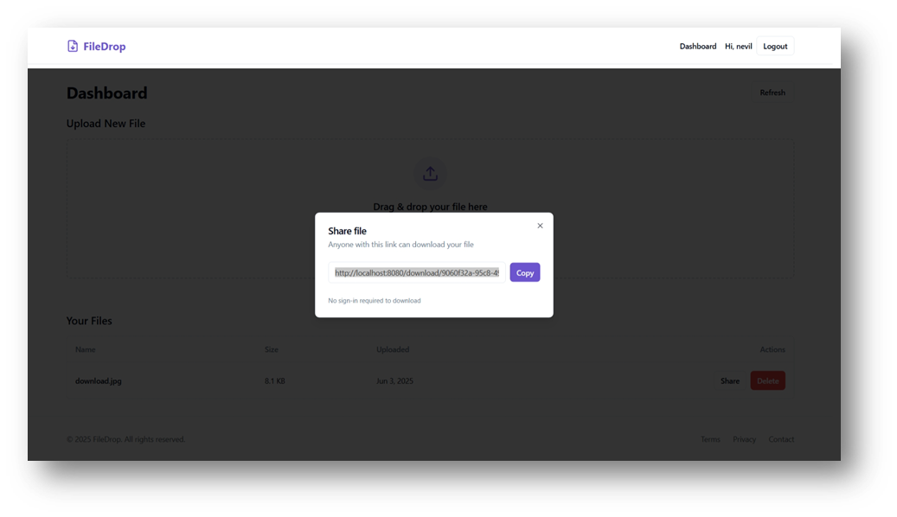

# 🚀 FileDrop — Secure File Sharing Micro-SaaS

**FileDrop** is a modern, web-based **Micro-SaaS** application that allows users to **upload files** and generate **secure, shareable links**. Designed for simplicity and speed, FileDrop is built using cutting-edge web technologies and offers a polished, intuitive user experience.

---

## 🌟 Features

- 📁 Upload files with ease
- 🔗 Generate secure, shareable links
- 🔐 User authentication (Register / Login / Logout)
- 💾 Supabase storage with public/private access handling
- ⚡ Fast development with Vite and optimized production builds
- 🎨 Clean and responsive UI with Tailwind CSS & Shadcn UI

---

## 🧠 What is a Micro-SaaS?

FileDrop is categorized as a **Micro-SaaS** — a lightweight, niche-focused Software-as-a-Service application. It is:

- 🚀 Built for a **specific task** (file sharing)
- 💡 Easy to deploy, maintain, and scale independently
- 👨‍💻 Ideal for indie developers or solo founders
- 💰 Monetizable via simple models (e.g., link expiry, storage limits)

---

## 🗂️ Project Structure

```
FileDrop/
├── public/
├── src/
│   ├── components/          # UI components (buttons, inputs, cards)
│   ├── pages/               # App pages (Landing, Upload, Auth, etc.)
│   ├── hooks/               # Custom React hooks
│   ├── lib/                 # Supabase client, helpers
│   └── main.tsx            # Entry point
├── tailwind.config.ts      # Tailwind config
├── index.html              # Base HTML
└── vite.config.ts          # Vite build config
```

---

## 🛠️ Installation & Setup

> Make sure you have **Node.js** and **npm** installed.

### 1️⃣ Clone the repository

```bash
git clone https://github.com/your-username/FileDrop.git
cd FileDrop
```

### 2️⃣ Install dependencies

```bash
npm install
```

### 3️⃣ Setup environment variables

Create a `.env` file at the root and add your **Supabase** credentials:

```env
VITE_SUPABASE_URL=your_supabase_url
VITE_SUPABASE_ANON_KEY=your_supabase_anon_key
```

> 🔑 Get these from [Supabase Project Settings](https://app.supabase.com)

### 4️⃣ Start the development server

```bash
npm run dev
```

---

## ⚙️ Technologies Used

| Layer        | Stack / Tool                         |
|--------------|--------------------------------------|
| Frontend     | React + TypeScript                   |
| Build Tool   | Vite                                 |
| Styling      | Tailwind CSS, Shadcn UI              |
| Backend/DB   | Supabase (PostgreSQL + Auth + Storage) |
| Package Mgr  | npm                                  |

---

## 📜 Scripts

```bash
npm run dev       # Start local dev server
npm run build     # Create production build
npm run preview   # Preview production build locally
```

---

## 🔐 Environment Variables

Create a `.env` file in the root with the following:

```env
VITE_SUPABASE_URL=your_supabase_url
VITE_SUPABASE_ANON_KEY=your_supabase_anon_key
```

---

## 📸 Screenshots 

Here are some screenshots showcasing the features and UI of **FileDrop**:

### 🏠 Landing Page


### 📤 File Upload Interface


### 🔗 Shareable File Link


### 🔐 Login Page


### 🧾 Register Page


---

## 📦 Deployment

You can deploy FileDrop on platforms like:

- [Vercel](https://vercel.com)
- [Netlify](https://netlify.com)

> Ensure that your `.env` variables are also configured in the deployment dashboard.

---

## 📄 License

This project is licensed under the [MIT License](LICENSE).

---

## 🙌 Acknowledgements

- [Supabase](https://supabase.com/)
- [Vite](https://vitejs.dev/)
- [Shadcn UI](https://ui.shadcn.com/)
- [Tailwind CSS](https://tailwindcss.com/)

---
